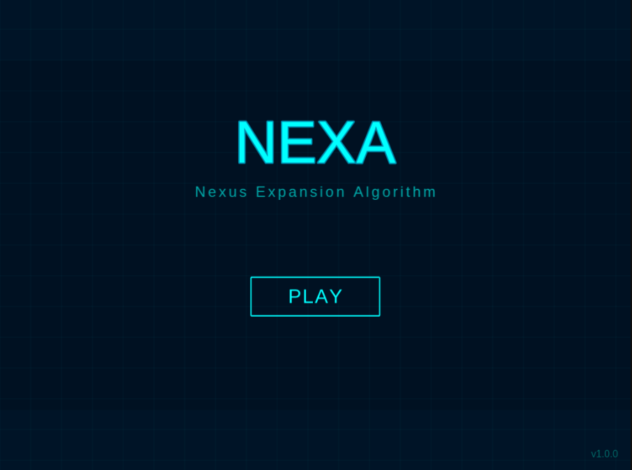

# Nexa - Sistema de Juego de Estrategia en Tiempo Real sobre Grafos
Nexa es un juego de estrategia en tiempo real donde dos jugadores compiten por controlar nodos en un grafo. Cada jugador gestiona la distribución de energía entre sus nodos para atacar y defender territorios. El sistema implementa Clean Architecture con TypeScript y Phaser 3, disponible a través de un navegador web moderno.



## Colaboradores
- Luis Gustavo Sequeiros Condori.
- Ricardo Chambilla
- Paul Cari Lipe
- Jhonathan Arias
- Raquel Quispe

## Requerimientos
- Node.js 18.x o superior.
- pnpm 8.x o superior (gestor de paquetes recomendado).
- Navegador web moderno con soporte para ES6+.
- TypeScript 5.7.
- Phaser 3.90.
- Vite 6.4 (incluido como dependencia de desarrollo).

## Consideraciones para la revision de las ramas y avances
- Este proyecto sigue el git workflow tradicional, en donde existe una rama principal (main) en donde se encuentra los releases, una rama dev donde se encuentran los cambios estables y de donde se bifurcan ramas de desarrollo y luego estan las ramas de desarrollo: uno por integrante, a excepcion de Ricardo que ha creado una rama por aumento que le corresponde (siguiendo la forma tradicional del git workflow).
- El estudiante Ricardo Chambilla Perca ha realizado sus features en ramas separadas para seguir el git workflow tradicional.
- Las ramas son: ricardo, ricardoDev, rickDeb, rickViber
- Estas ramas se mergearon con la rama dev, en donde todas las features estables residen.

## Instalación Local

### Clonar el repositorio
```bash
git clone https://github.com/gustadev24/nexa.git
cd nexa
```

### Instalar dependencias
```bash
pnpm install
```

### Iniciar servidor de desarrollo
```bash
pnpm run dev
```

### Construir para producción
```bash
pnpm run build
```

### Previsualizar build de producción
```bash
pnpm run preview
```

## Acceder al juego desde el navegador Web
- http://localhost:8080

## Scripts Disponibles

### Desarrollo con logs
```bash
pnpm run dev
```

### Desarrollo sin logs
```bash
pnpm run dev-nolog
```

### Build de producción con logs
```bash
pnpm run build
```

### Build de producción sin logs
```bash
pnpm run build-nolog
```

## Cómo Jugar

### Controles Básicos

1. Seleccionar nodo: Click izquierdo en un nodo de tu propiedad
2. Asignar energía de ataque: Arrastra desde tu nodo hacia un nodo vecino
3. Gestión de defensa: La energía no asignada permanece como defensa automáticamente
4. Capturar nodos: Envía energía de ataque suficiente para superar la defensa enemiga

### Tipos de Nodos

- Básico:   Funcionalidad estándar (intervalos normales, multiplicadores 1x)
- Ataque:   Duplica energía de ataque (multiplicador 2x en ataques)
- Defensa:  Duplica defensa del nodo (multiplicador 2x en defensa)
- Energía:  Proporciona 50 unidades de energía adicional al capturarlo

### Mecánicas del Sistema

- Energía conservativa: La energía total se distribuye entre nodos y ataques
- Sistema de colisiones: Paquetes enemigos se destruyen según magnitud
- Captura de nodos: Ocurre cuando ataque > defensa
- Fragmentación: Perder un nodo crítico puede desconectar parte de tu grafo

### Condiciones de Victoria

- Victoria por Dominación: Controlar ≥70% de nodos durante 10 segundos continuos
- Victoria por Tiempo: Mayor cantidad de nodos al finalizar los 3 minutos
- Victoria por Eliminación: Capturar el nodo inicial del oponente

## Estructura del Proyecto
```bash
nexa/
├── src/
│   ├── core/                      # Capa de dominio (entidades, tipos)
│   ├── application/               # Capa de aplicación (servicios, lógica de negocio)
│   ├── infrastructure/            # Capa de infraestructura (adaptadores, controladores)
│   ├── presentation/              # Capa de presentación (escenas de Phaser)
│   ├── game.ts                    # Configuración de Phaser
│   └── main.ts                    # Punto de entrada
├── public/                        # Assets estáticos
├── vite/                          # Configuración de Vite
└── docs/                          # Documentación
```

## Arquitectura

El proyecto implementa Clean Architecture con cuatro capas:

### Core Layer (Dominio):
- Entidades: Node, Edge, Player, Graph, EnergyPacket
- Value Objects: ID, NodeType, Color

### Application Layer (Casos de Uso):
- Servicios: TickService, CollisionService, CaptureService, VictoryService
- Interfaces: Contratos para comunicación entre capas

### Infrastructure Layer (Adaptadores):
- GameController: Orquestador principal (patrón Facade)
- GameRenderer: Adaptador de Phaser
- GameFactory: Factory de componentes con inyección de dependencias

### Presentation Layer (UI):
- Escenas de Phaser: Boot, MainMenu, Game, GameOver

## Configuración de TypeScript
```bash
Path Aliases configurados en tsconfig.json:
@/          → src/
@/core      → src/core/
@/application    → src/application/
@/infrastructure → src/infrastructure/
@/presentation   → src/presentation/
```

## Tecnologías Utilizadas
- TypeScript 5.7    - Lenguaje principal con tipado estricto
- Phaser 3.90       - Motor de juegos HTML5
- Vite 6.4          - Build tool y servidor de desarrollo
- pnpm 8.x          - Gestor de paquetes eficiente

## Información Académica
- Universidad Nacional de San Agustín de Arequipa
- Facultad: Ingeniería de Producción y Servicios
- Escuela Profesional: Ingeniería de Sistemas
- Curso: Ingeniería de Software
- Año: 2025

## Licencia
Este proyecto está bajo la licencia MIT.

## Repositorio
https://github.com/gustadev24/nexa
