# Manual de Usuario - NEXA

## Contenido

0. [Acerca de NEXA](#0-acerca-de-nexa)
1. [¿Quiénes deben leer este documento?](#1-quiénes-deben-leer-este-documento)
2. [Pantallas y funcionalidades del juego NEXA](#2-pantallas-y-funcionalidades-del-juego-nexa)
   - 2.1. [Portada principal del juego NEXA](#21-portada-principal-del-juego-nexa)
   - 2.2. [Bloques de la portada principal](#22-bloques-de-la-portada-principal)
   - 2.3. [Iniciar una partida en NEXA](#23-iniciar-una-partida-en-nexa)
   - 2.4. [Configuración inicial del juego](#24-configuración-inicial-del-juego)
   - 2.5. [Interfaz principal del campo de juego](#25-interfaz-principal-del-campo-de-juego)
   - 2.6. [Panel de información (HUD superior)](#26-panel-de-información-hud-superior)
   - 2.7. [Visualización del grafo](#27-visualización-del-grafo)
3. [Mecánicas del juego](#3-mecánicas-del-juego)
   - 3.1. [Seleccionar un nodo propio](#31-seleccionar-un-nodo-propio)
   - 3.2. [Asignar energía de ataque a una arista](#32-asignar-energía-de-ataque-a-una-arista)
   - 3.3. [Gestión automática de defensa](#33-gestión-automática-de-defensa)
   - 3.4. [Visualización de paquetes de energía en tránsito](#34-visualización-de-paquetes-de-energía-en-tránsito)
   - 3.5. [Sistema de colisiones entre paquetes](#35-sistema-de-colisiones-entre-paquetes)
   - 3.6. [Captura de nodos enemigos](#36-captura-de-nodos-enemigos)
   - 3.7. [Captura de nodos neutrales](#37-captura-de-nodos-neutrales)
4. [Tipos de nodos especializados](#4-tipos-de-nodos-especializados)
   - 4.1. [Nodo Básico](#41-nodo-básico)
   - 4.2. [Nodo de Ataque](#42-nodo-de-ataque)
   - 4.3. [Nodo de Defensa](#43-nodo-de-defensa)
   - 4.4. [Nodo de Energía](#44-nodo-de-energía)
5. [Condiciones de victoria y derrota](#5-condiciones-de-victoria-y-derrota)
   - 5.1. [Victoria por Dominación](#51-victoria-por-dominación)
   - 5.2. [Victoria por Tiempo Límite](#52-victoria-por-tiempo-límite)
   - 5.3. [Victoria por Eliminación](#53-victoria-por-eliminación)
   - 5.4. [Pantalla de fin de partida](#54-pantalla-de-fin-de-partida)
6. [Estrategias y consejos avanzados](#6-estrategias-y-consejos-avanzados)
   - 6.1. [Estrategia de expansión gradual](#61-estrategia-de-expansión-gradual)
   - 6.2. [Identificación de nodos de articulación](#62-identificación-de-nodos-de-articulación)
   - 6.3. [Gestión eficiente de energía](#63-gestión-eficiente-de-energía)
   - 6.4. [Defensa de puntos críticos](#64-defensa-de-puntos-críticos)
7. [Solución de problemas comunes](#7-solución-de-problemas-comunes)
   - 7.1. [El juego no carga o presenta errores](#71-el-juego-no-carga-o-presenta-errores)
   - 7.2. [Rendimiento bajo o lag](#72-rendimiento-bajo-o-lag)
   - 7.3. [Controles no responden correctamente](#73-controles-no-responden-correctamente)
8. [Anexos](#8-anexos)
   - 8.1. [Tabla comparativa de tipos de nodos](#81-tabla-comparativa-de-tipos-de-nodos)
   - 8.2. [Glosario de términos técnicos](#82-glosario-de-términos-técnicos)

---

## 0. Acerca de NEXA

NEXA es un juego de estrategia en tiempo real desarrollado con TypeScript y Phaser 3, donde dos jugadores compiten por el control de nodos en un grafo. El sistema implementa mecánicas de gestión de energía conservativa, sistema de colisiones determinístico y detección de fragmentación de grafos mediante algoritmos de teoría de grafos.

El juego fue desarrollado como proyecto académico por estudiantes de Ingeniería de Sistemas de la Universidad Nacional de San Agustín de Arequipa, aplicando principios de Clean Architecture y patrones de diseño modernos.

**Versión:** 1.0.0  
**Plataforma:** Navegadores web modernos (Chrome, Firefox, Edge, Safari)  
**Tecnología:** TypeScript 5.7, Phaser 3.90, Vite 6.4  
**Licencia:** MIT

---

## 1. ¿Quiénes deben leer este documento?

Este manual está dirigido a:

- **Jugadores nuevos** que desean aprender las mecánicas básicas del juego.
- **Jugadores intermedios** que buscan mejorar sus estrategias y entender mecánicas avanzadas.
- **Usuarios finales** que acceden al juego desde el navegador web.
- **Desarrolladores** que desean entender la funcionalidad desde la perspectiva del usuario.
- **Evaluadores académicos** que requieren comprender el funcionamiento completo del sistema.

**Nota:** Para documentación técnica de desarrollo, consultar la memoria descriptiva y documentación del código fuente en el directorio `docs/` del repositorio.

---

## 2. Pantallas y funcionalidades del juego NEXA

### 2.1. Portada principal del juego NEXA

Al acceder al juego NEXA desde el navegador web (URL: http://localhost:8080 en instalación local), el usuario visualiza la pantalla principal o menú de inicio.

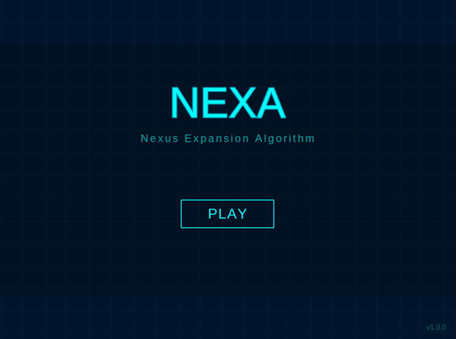

---

### 2.2. Bloques de la portada principal

La portada principal de NEXA está compuesta por los siguientes elementos visuales:

1. **Encabezado superior:** Contiene el título del juego y versión.
2. **Panel central:** Botones de interacción principal (Iniciar Partida, Instrucciones).
3. **Pie de página:** Información de créditos y enlace al repositorio.


---

### 2.3. Iniciar una partida en NEXA

Para iniciar una nueva partida, el usuario debe:

1. En la pantalla principal, hacer clic en el botón **"Iniciar Partida"** o **"Jugar"**.
2. El sistema realiza la transición a la escena de juego (GameScene).
3. Se genera automáticamente el grafo del campo de batalla.
4. Se asignan los nodos iniciales a cada jugador (Jugador 1: azul, Jugador 2: rojo).
5. El juego inicia el contador de tiempo (3 minutos).

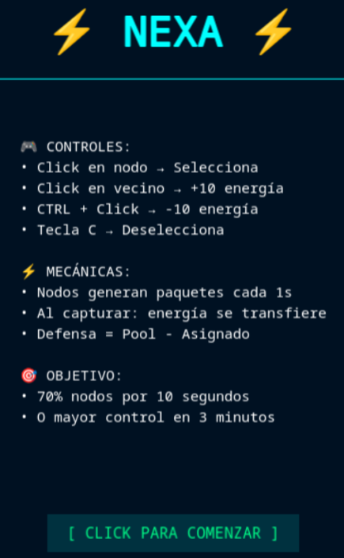

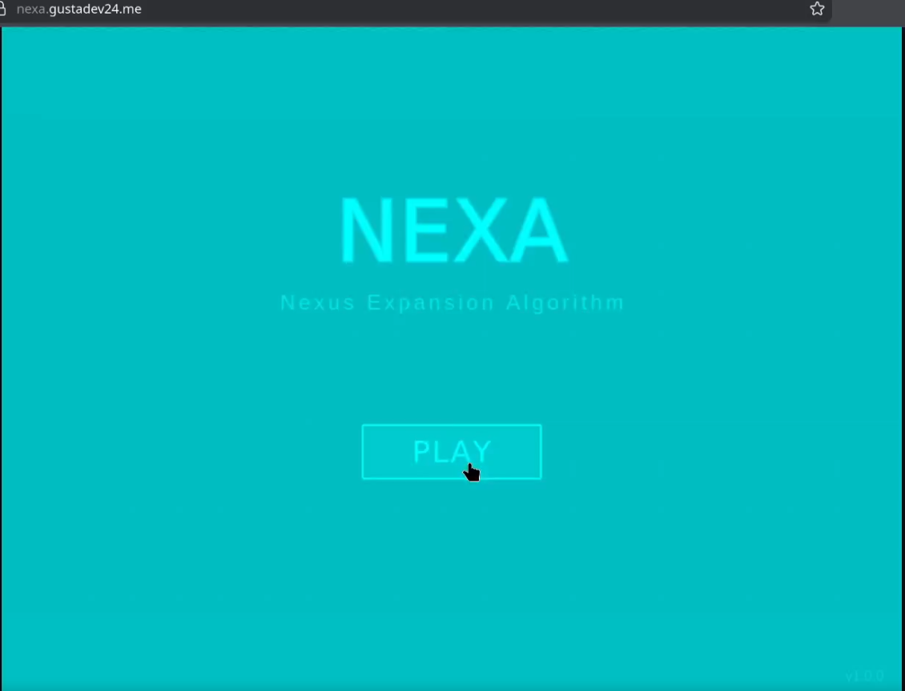

**[IMAGEN REQUERIDA 04]**
**Ubicación:** Sección 2.3
**Descripción:** Transición o pantalla de carga entre el menú y el campo de juego
**Nota para captura:** Si existe animación de transición, capturar el frame intermedio

### 2.4. Configuración inicial del juego

Al iniciar la partida, el sistema configura automáticamente:

- **Grafo del juego:** Estructura de nodos y aristas generada proceduralmente.
- **Nodos iniciales:** Cada jugador inicia controlando un nodo base.
- **Energía inicial:** Cada jugador comienza con la energía del nodo asignado (generalmente 20 unidades).
- **Distribución de tipos:** Los nodos especiales (Ataque, Defensa, Energía) se distribuyen en el grafo.
- **Temporizador:** Se inicia el conteo de 3 minutos (180 segundos).

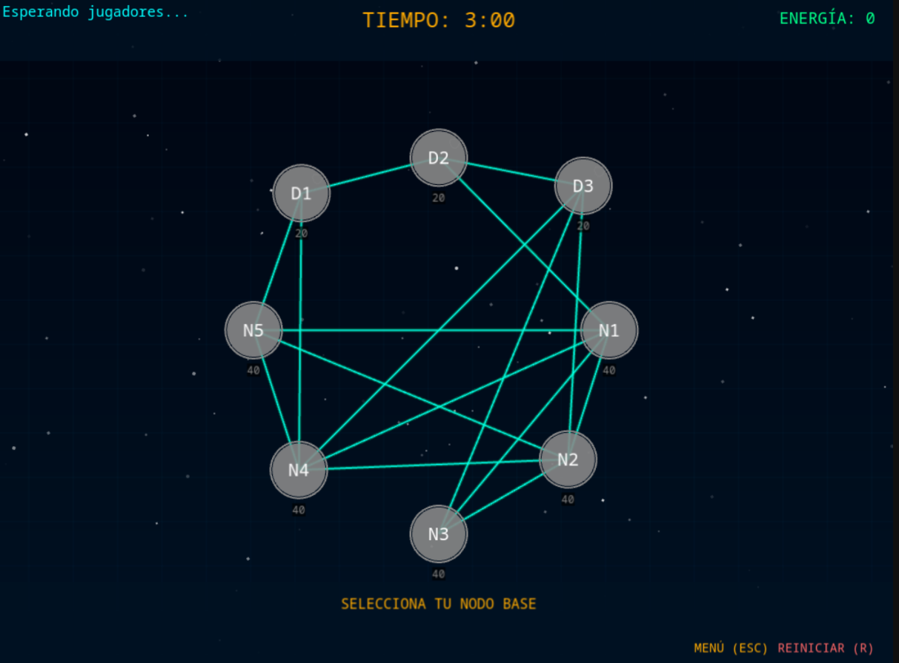

### 2.5. Interfaz principal del campo de juego

La interfaz del campo de juego se compone de tres áreas principales:

1. **HUD Superior:** Información de tiempo, dominación y estadísticas.
2. **Campo de juego central:** Visualización del grafo con nodos y aristas.
3. **HUD Inferior:** (Opcional) Controles adicionales o mensajes del sistema.

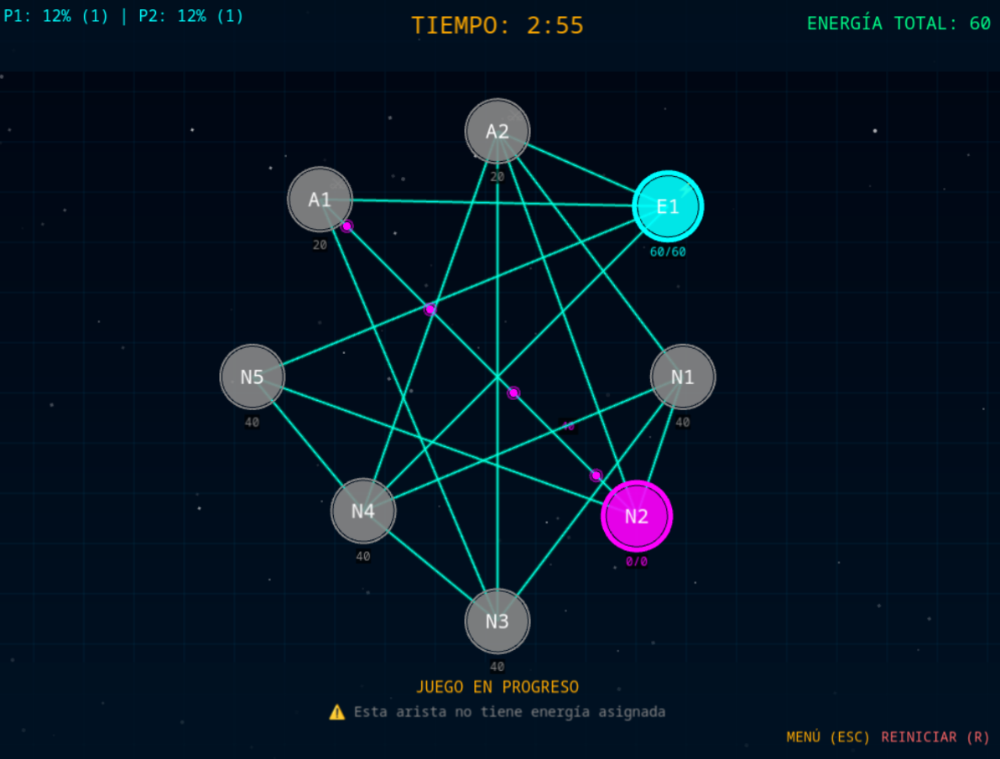


### 2.6. Panel de información (HUD superior)

El HUD superior muestra información crítica en tiempo real:

- **Temporizador:** Tiempo restante de partida (formato MM:SS).
- **Dominación Jugador 1:** Porcentaje de nodos controlados por jugador azul.
- **Dominación Jugador 2:** Porcentaje de nodos controlados por jugador rojo.
- **Energía Total Jugador 1:** (Opcional) Energía total disponible.
- **Energía Total Jugador 2:** (Opcional) Energía total disponible.
- **Indicador de progreso hacia victoria por dominación:** Barra o contador que muestra el tiempo sostenido de dominación.

**[IMAGEN REQUERIDA 07]**
**Ubicación:** Sección 2.6
**Descripción:** Primer plano del HUD superior con todos los elementos visibles:
- Temporizador mostrando tiempo (ej: 02:34)
- Indicadores de dominación (ej: Jugador 1: 45%, Jugador 2: 35%)
- Barra de progreso hacia victoria por dominación si un jugador domina ≥70%
**Nota para captura:** Capturar cuando ambos jugadores tengan nodos controlados

---

### 2.7. Visualización del grafo

El campo de juego central muestra la representación visual del grafo:

**Elementos visuales:**

- **Nodos:** Círculos de diferentes colores según propietario:
  - Azul: Controlado por Jugador 1
  - Rojo: Controlado por Jugador 2
  - Gris/Blanco: Sin propietario (neutral)

- **Aristas:** Líneas que conectan nodos adyacentes.

- **Paquetes de energía:** Partículas o esferas pequeñas que se mueven por las aristas.

- **Indicadores de tipo:** Cada nodo muestra un ícono o color distintivo según su tipo (Básico, Ataque, Defensa, Energía).


## 3. Mecánicas del juego

### 3.1. Seleccionar un nodo propio

Para interactuar con un nodo, el jugador debe:

1. Hacer **clic izquierdo** sobre un nodo de su propiedad (color azul para Jugador 1, rojo para Jugador 2).
2. El nodo seleccionado se resalta visualmente (borde brillante, aumento de tamaño, etc.).
3. Aparece información del nodo seleccionado: energía actual, tipo de nodo, energía asignada a aristas.

**Restricción:** Solo se pueden seleccionar nodos propios. Hacer clic en nodos enemigos o neutrales no tiene efecto.

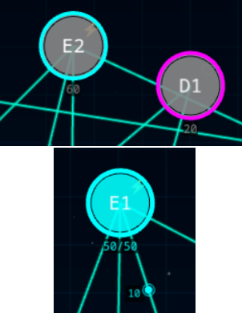

### 3.2. Asignar energía de ataque a una arista

Una vez seleccionado un nodo propio, el jugador puede asignar energía de ataque:

1. Con el nodo seleccionado, hacer **clic y mantener presionado** sobre el nodo.
2. **Arrastrar** el cursor hacia un nodo vecino conectado por una arista.
3. **Soltar** el botón del ratón sobre el nodo vecino destino.
4. El sistema asigna una cantidad de energía (por defecto 10 unidades) a esa arista.
5. La energía asignada se resta del nodo origen y comienza a viajar por la arista como paquetes de energía.

**Nota:** El nodo destino puede ser enemigo, neutral o incluso propio (no recomendado, genera desperdicio si se envía energía opuesta).

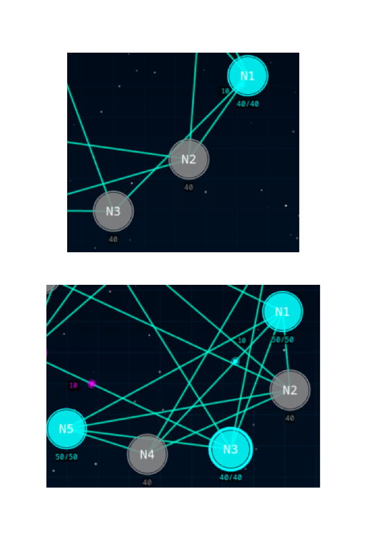

### 3.3. Gestión automática de defensa

La energía no asignada a aristas permanece automáticamente en el nodo como defensa:

- **Defensa = Energía del nodo × Multiplicador de defensa del tipo de nodo**
- La defensa se regenera cada cierto intervalo (configurable por tipo de nodo).
- La defensa protege el nodo contra ataques enemigos.

**Ejemplo:**
- Nodo Básico con 30 unidades de energía → Defensa = 30 × 1.0 = 30
- Nodo de Defensa con 30 unidades → Defensa = 30 × 2.0 = 60 (duplica defensa)

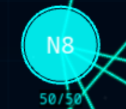

### 3.4. Visualización de paquetes de energía en tránsito

Los paquetes de energía son representaciones visuales de energía viajando por aristas:

- **Apariencia:** Esferas pequeñas, partículas o puntos de color según el jugador propietario.
- **Movimiento:** Se desplazan desde el nodo origen hacia el nodo destino.
- **Velocidad:** Configurable en el sistema (DEFAULT_SPEED = 0.002).
- **Cantidad:** La cantidad de energía puede representarse por el tamaño del paquete o un número visible.

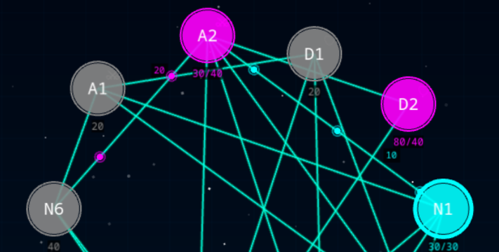

### 3.5. Sistema de colisiones entre paquetes

Cuando paquetes de energía enemigos se encuentran en la misma arista, ocurre una colisión:

**Reglas de colisión:**

1. **Energías iguales:** Ambos paquetes se destruyen completamente.
2. **Energías diferentes:** El paquete con mayor energía continúa con energía = diferencia.
   - Ejemplo: Paquete azul (25) vs Paquete rojo (15) → Paquete azul continúa con 10.

**Efecto visual:** Animación de explosión, destello o partículas al momento de la colisión.

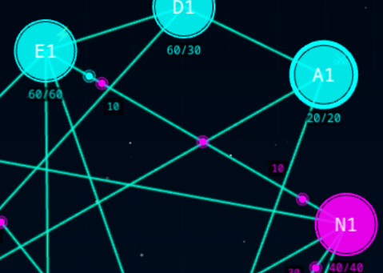

### 3.6. Captura de nodos enemigos

Para capturar un nodo enemigo:

1. Enviar suficiente energía de ataque para superar la defensa del nodo.
2. Cuando la energía de ataque llega al nodo destino:
   - Si **Ataque > Defensa:** El nodo cambia de propietario. La energía sobrante se convierte en la nueva defensa del nodo.
   - Si **Ataque = Defensa:** El nodo queda neutral (sin propietario).
   - Si **Ataque < Defensa:** El ataque se destruye y la defensa del nodo se reduce.

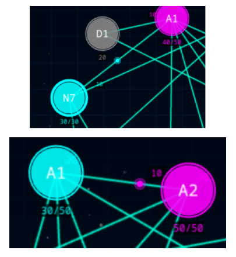

### 3.7. Captura de nodos neutrales

Los nodos neutrales (sin propietario) pueden ser capturados más fácilmente:

- No tienen defensa activa (defensa = 0).
- Cualquier cantidad de energía que llegue captura el nodo.
- La energía del paquete se convierte en la energía inicial del nodo capturado.

**Estrategia:** Capturar nodos neutrales es la forma más rápida de expandirse al inicio del juego.

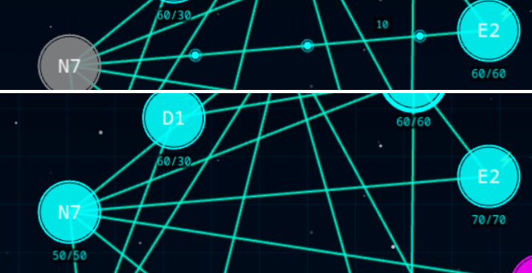

## 4. Tipos de nodos especializados

### 4.1. Nodo Básico

**Características:**
- **Color distintivo:** Blanco o color base sin indicador especial.
- **Intervalo de ataque:** 2000ms (emite paquetes cada 2 segundos).
- **Intervalo de defensa:** 3000ms (regenera defensa cada 3 segundos).
- **Multiplicador de ataque:** 1.0x (sin bonificación).
- **Multiplicador de defensa:** 1.0x (sin bonificación).
- **Energía inicial:** 20 unidades al capturarlo.

**Uso:** Nodo estándar sin ventajas especiales. Útil para expansión general.

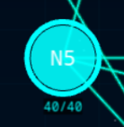

### 4.2. Nodo de Ataque

**Características:**
- **Color distintivo:** Rojo oscuro o con icono de espada/ataque.
- **Intervalo de ataque:** 1000ms (emite paquetes cada 1 segundo - ¡el doble de rápido!).
- **Intervalo de defensa:** 3000ms (estándar).
- **Multiplicador de ataque:** 2.0x (duplica la energía enviada por aristas).
- **Multiplicador de defensa:** 1.0x (defensa normal).
- **Energía inicial:** 20 unidades.

**Uso:** Ideal para ofensivas agresivas. Controlar este nodo multiplica la presión sobre el enemigo.


### 4.3. Nodo de Defensa

**Características:**
- **Color distintivo:** Verde o con icono de escudo/defensa.
- **Intervalo de ataque:** 2000ms (estándar).
- **Intervalo de defensa:** 1500ms (regenera defensa cada 1.5 segundos - más rápido).
- **Multiplicador de ataque:** 1.0x (ataque normal).
- **Multiplicador de defensa:** 2.0x (duplica la defensa del nodo).
- **Energía inicial:** 20 unidades.

**Uso:** Ideal para posiciones defensivas. Difícil de capturar para el enemigo.

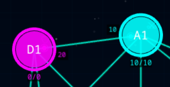

### 4.4. Nodo de Energía

**Características:**
- **Color distintivo:** Amarillo, dorado o con icono de rayo/energía.
- **Intervalo de ataque:** 2000ms (estándar).
- **Intervalo de defensa:** 3000ms (estándar).
- **Multiplicador de ataque:** 1.0x (ataque normal).
- **Multiplicador de defensa:** 1.0x (defensa normal).
- **Energía inicial:** 50 unidades (¡más del doble que nodos normales!).

**Uso:** Capturar este nodo otorga un boost significativo de recursos. Es un objetivo prioritario.

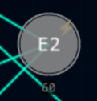

## 5. Condiciones de victoria y derrota

### 5.1. Victoria por Dominación

**Condición:** Controlar al menos el 70% de los nodos del grafo de forma sostenida durante 10 segundos consecutivos.

**Proceso:**
1. Un jugador alcanza 70% o más de nodos controlados.
2. El sistema inicia un contador de 10 segundos.
3. Si el jugador mantiene ≥70% durante todo el periodo, gana.
4. Si pierde la mayoría antes de los 10 segundos, el contador se reinicia.

**Indicador visual:** Barra de progreso o contador en el HUD mostrando el tiempo acumulado de dominación.

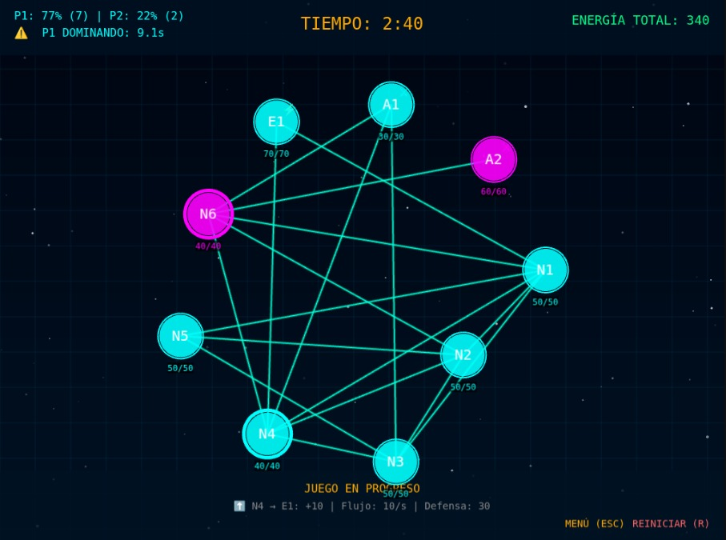

### 5.2. Victoria por Tiempo Límite

**Condición:** Al finalizar los 3 minutos (180 segundos), el jugador con mayor cantidad de nodos controlados gana.

**Proceso:**
1. El temporizador llega a 00:00.
2. El sistema cuenta los nodos de cada jugador.
3. El jugador con más nodos es declarado ganador.
4. Si ambos tienen la misma cantidad, la partida termina en empate.

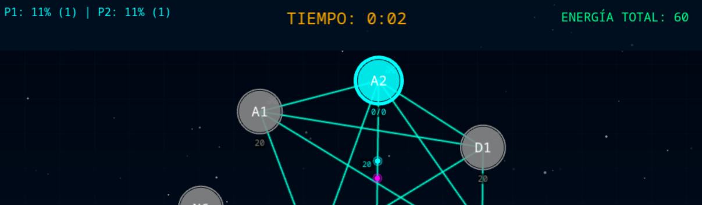

### 5.3. Victoria por Eliminación

**Condición:** Si un jugador pierde su nodo inicial (base), pierde inmediatamente la partida.

**Proceso:**
1. El nodo inicial de un jugador es capturado por el oponente.
2. El juego termina instantáneamente.
3. El jugador que capturó el nodo inicial es declarado ganador.

**Importancia:** El nodo inicial es crítico. Perderlo significa derrota automática sin importar otros factores.


### 5.4. Pantalla de fin de partida

Al finalizar la partida por cualquier condición de victoria, el juego muestra la pantalla de Game Over:

**Información mostrada:**
- Resultado: "Victoria" o "Derrota" según el jugador local.
- Condición de victoria: "Victoria por Dominación", "Victoria por Tiempo", "Victoria por Eliminación".
- Estadísticas finales:
  - Nodos controlados por cada jugador
  - Energía total acumulada
  - Tiempo de dominación sostenida
  - Capturas realizadas

**Opciones:**
- Botón "Volver al Menú": Regresa al menú principal.
- Botón "Revancha": Inicia una nueva partida inmediatamente.

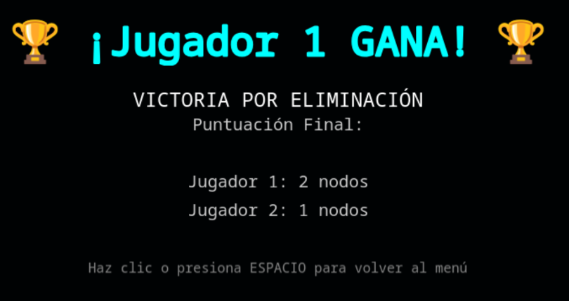

## 6. Estrategias y consejos avanzados

### 6.1. Estrategia de expansión gradual

**Para principiantes:**

1. **Capturar nodos neutrales primero:** Son los más fáciles de obtener y no requieren combate.
2. **Expandirse desde el nodo inicial:** Controlar nodos cercanos para mantener conectividad.
3. **No sobreextenderse:** Mantener una masa compacta de nodos en lugar de nodos dispersos.

**Diagrama conceptual:**

```
Inicio:  [Nodo Inicial] → [Neutral] → [Neutral]
                ↓
            [Neutral]

Evitar:  [Nodo Inicial] ... [Neutral disperso] ... [Neutral lejano]
```

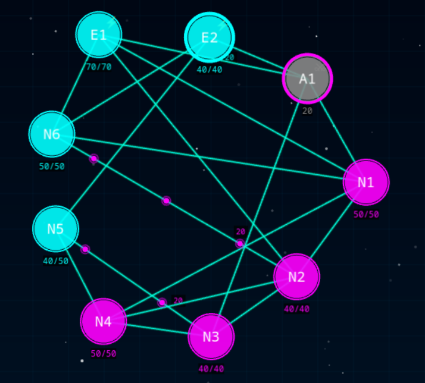

### 6.2. Identificación de nodos de articulación

**Concepto avanzado:** Los nodos de articulación son nodos críticos que, al ser capturados, dividen el grafo.

**Consecuencia:** Si pierdes un nodo de articulación, puedes perder todos los nodos en el subgrafo desconectado que no contiene tu nodo inicial.

**Cómo identificarlos:**
- Son nodos que conectan dos o más grupos de nodos.
- Si se eliminan, crean fragmentos aislados en el grafo.

**Estrategia:**
- **Defensa:** Proteger tus nodos de articulación con alta defensa.
- **Ataque:** Identificar y atacar nodos de articulación del enemigo para fragmentar su territorio.

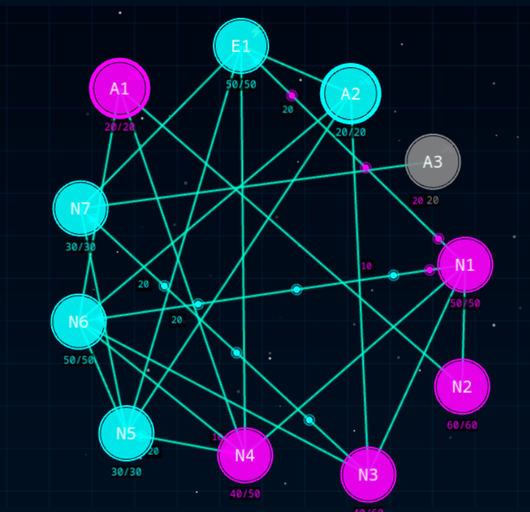

### 6.3. Gestión eficiente de energía

**Principios:**

1. **Conservación:** Recuerda que la energía total es constante. No se genera nueva energía excepto al capturar Nodos de Energía.

2. **Priorización:** Decide si invertir energía en ataque (expandirse) o defensa (mantener posiciones).

3. **Balance:** Mantén suficiente energía en nodos de defensa para proteger posiciones clave.

4. **Evitar desperdicio:** No enviar energía en direcciones opuestas desde el mismo nodo (se anulan).

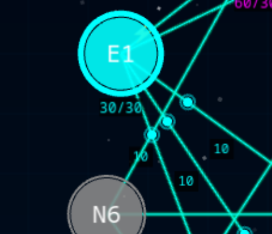

### 6.4. Defensa de puntos críticos

**Nodos críticos a defender:**

1. **Nodo inicial:** Perderlo significa derrota inmediata.
2. **Nodos de articulación:** Perderlos fragmenta tu territorio.
3. **Nodos de Energía:** Son objetivos valiosos para el enemigo.
4. **Nodos frontera:** Nodos en contacto directo con el enemigo.

**Técnicas de defensa:**

- **Acumular energía:** Mantener alta energía en nodos defensivos.
- **Usar Nodos de Defensa:** Controlar y mantener nodos tipo Defensa en posiciones clave.
- **Monitoreo constante:** Observar ataques enemigos y reforzar defensas amenazadas.

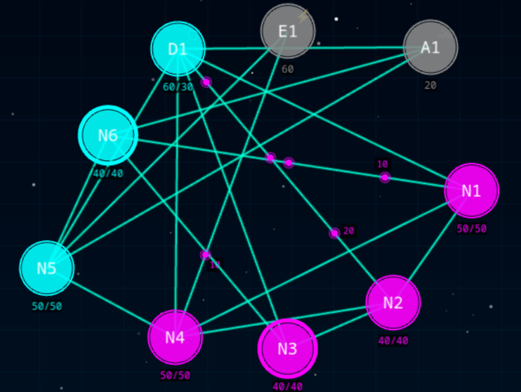

## 7. Solución de problemas comunes

### 7.1. El juego no carga o presenta errores

**Síntomas:**
- Pantalla en blanco al acceder a la URL.
- Mensajes de error en la consola del navegador.
- El juego se queda en pantalla de carga indefinidamente.

**Soluciones:**

1. **Verificar navegador compatible:**
   - Chrome 90+, Firefox 88+, Edge 90+, Safari 14+
   - JavaScript habilitado

2. **Limpiar caché del navegador:**
   - Chrome: Ctrl+Shift+Del → Borrar caché e imágenes
   - Firefox: Ctrl+Shift+Del → Caché

3. **Verificar consola de errores:**
   - F12 → Pestaña "Console"
   - Buscar mensajes de error en rojo

4. **Reinstalar (Instalación Local):**
   ```bash
   rm -rf node_modules
   pnpm install
   pnpm run dev
   ```

5. **Verificar servidor:**
   - Confirmar que el servidor local está corriendo en el puerto 8080
   - Revisar mensajes en la terminal donde se ejecutó `pnpm run dev`

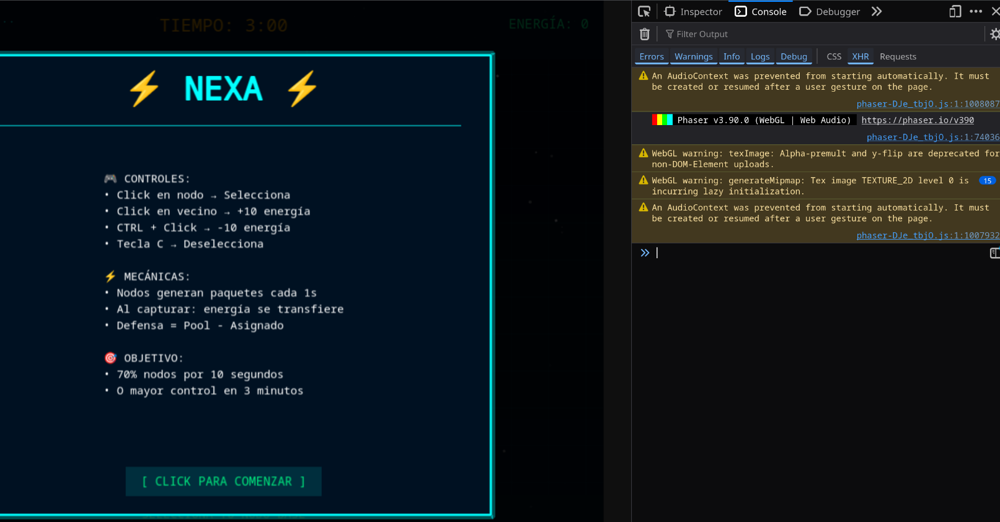

### 7.2. Rendimiento bajo o lag

**Síntomas:**
- Animaciones entrecortadas.
- Movimiento de paquetes de energía poco fluido.
- Retraso en la respuesta de clics.

**Soluciones:**

1. **Cerrar aplicaciones en segundo plano:**
   - Cerrar pestañas innecesarias del navegador.
   - Cerrar aplicaciones que consuman recursos.

2. **Reducir calidad gráfica (si aplica):**
   - Algunas versiones pueden incluir configuración de calidad.

3. **Actualizar navegador:**
   - Usar la última versión del navegador.

4. **Verificar hardware:**
   - Requisitos mínimos: 2GB RAM, procesador dual-core.
   - Resolución recomendada: 1280x720 o superior.

5. **Probar en modo incógnito:**
   - Desactiva extensiones que puedan causar conflictos.

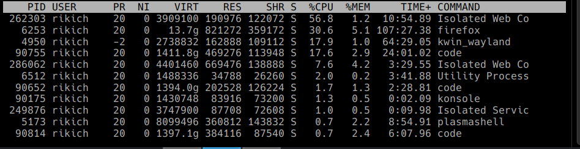

### 7.3. Controles no responden correctamente

**Síntomas:**
- Clics en nodos no seleccionan el nodo.
- Arrastrar no asigna energía.
- Controles funcionan intermitentemente.

**Soluciones:**

1. **Verificar que el clic es en nodo propio:**
   - Solo se pueden seleccionar nodos del color del jugador.

2. **Hacer clic directamente en el centro del nodo:**
   - El área de clic puede ser sensible.

3. **Verificar que el nodo destino está conectado:**
   - Solo se puede enviar energía a nodos vecinos conectados por arista.

4. **Recargar la página:**
   - F5 o Ctrl+R para reiniciar el juego.

5. **Verificar JavaScript habilitado:**
   - El juego requiere JavaScript activo.

6. **Probar con ratón diferente (si aplica):**
   - Problemas de hardware del dispositivo de entrada.

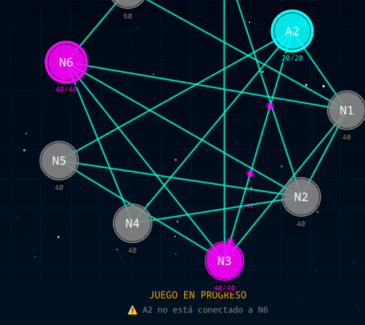

## 8. Anexos

### 8.1. Tabla comparativa de tipos de nodos

| Tipo | Intervalo Ataque | Intervalo Defensa | Mult. Ataque | Mult. Defensa | Energía Inicial |
|------|------------------|-------------------|--------------|---------------|-----------------|
| Básico | 2000ms | 3000ms | 1.0x | 1.0x | 20 |
| Ataque | 1000ms | 3000ms | 2.0x | 1.0x | 20 |
| Defensa | 2000ms | 1500ms | 1.0x | 2.0x | 20 |
| Energía | 2000ms | 3000ms | 1.0x | 1.0x | 50 |

**Leyenda:**
- **Intervalo Ataque:** Frecuencia de emisión de paquetes de energía (menor = más rápido).
- **Intervalo Defensa:** Frecuencia de regeneración de defensa (menor = más rápido).
- **Mult. Ataque:** Multiplicador aplicado a la energía enviada por aristas.
- **Mult. Defensa:** Multiplicador aplicado a la defensa del nodo.
- **Energía Inicial:** Energía que aporta al jugador al capturarlo.

---

### 8.2. Glosario de términos técnicos

**Arista:** Conexión entre dos nodos en el grafo. Permite el tránsito de paquetes de energía.

**Captura:** Acción de tomar control de un nodo enemigo o neutral al superar su defensa con energía de ataque.

**Defensa:** Energía que protege un nodo contra ataques. Se calcula como: Energía del nodo × Multiplicador de defensa.

**Dominación:** Porcentaje de nodos controlados por un jugador respecto al total de nodos del grafo.

**Energía conservativa:** Principio del juego donde la energía total del jugador se mantiene constante (no se genera nueva energía, solo se redistribuye).

**Fragmentación:** División del grafo en componentes desconectados al perder un nodo de articulación.

**Grafo:** Estructura matemática compuesta por nodos (vértices) y aristas (conexiones) que representa el campo de juego.

**HUD (Heads-Up Display):** Interfaz de usuario que muestra información en tiempo real durante el juego (tiempo, dominación, estadísticas).

**Nodo:** Elemento fundamental del grafo que puede almacenar energía y ser controlado por los jugadores.

**Nodo de articulación:** Nodo crítico cuya pérdida divide el grafo en fragmentos desconectados.

**Nodo inicial (Base):** Nodo desde el cual cada jugador inicia la partida. Perderlo significa derrota inmediata.

**Paquete de energía:** Representación visual de energía viajando por una arista desde un nodo origen hacia un nodo destino.

**Tick:** Ciclo mínimo de actualización del juego. El sistema ejecuta operaciones cada tick (actualización de defensa, emisión de paquetes, resolución de colisiones, etc.).

---

## Información del Manual

**Versión del Manual:** 1.0  
**Fecha de actualización:** Diciembre 2024  
**Versión del juego:** NEXA v1.0.0  

**Equipo de Desarrollo:**
- Luis Gustavo Sequeiros Condori (Tech Lead)
- Ricardo Chambilla (Backend Developer)
- Paul Cari Lipe (QA Engineer)
- Jhon Aquino (Game Developer)
- Raquel Quispe (UI/UX Developer)
- Rafael Chambilla (Integration Engineer)

**Institución:**  
Universidad Nacional de San Agustín de Arequipa  
Escuela Profesional de Ingeniería de Sistemas  
Curso: Ingeniería de Software  
Año: 2024

**Contacto y Soporte:**  
- Repositorio: https://github.com/gustadev24/nexa  
- Issues: https://github.com/gustadev24/nexa/issues  
- Email: lgsc21211@gmail.com

---

**Fin del Manual de Usuario**
