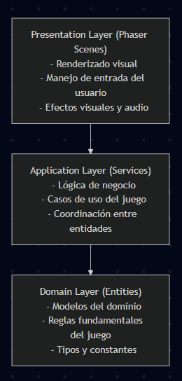

# 📜 Memoria Descriptiva del Juego Nexa

**Título:** Nexa - Juego de Estrategia en Tiempo Real sobre Grafos  
**Versión:** 1.0.0  
**Fecha:** Diciembre 2025  
**Equipo de Desarrollo:** Equipo Nexa - UNSA

---

## 1. Introducción

La presente memoria descriptiva documenta el funcionamiento, instalación y uso del juego **Nexa**. Nexa es un juego de estrategia en tiempo real desarrollado bajo el framework **Phaser 3** utilizando **TypeScript**, con arquitectura limpia de tres capas.

Es una aplicación de entretenimiento que permite a dos jugadores competir en un campo de batalla representado como un grafo, donde deben gestionar recursos de energía para controlar nodos y alcanzar la victoria mediante diferentes condiciones estratégicas.

Los usuarios principales son **jugadores competitivos** que disfrutan de juegos de estrategia en tiempo real con mecánicas innovadoras basadas en teoría de grafos.

---

## 2. Arquitectura y Plataforma Tecnológica

Nexa es una aplicación web desarrollada en **TypeScript** sobre el framework de juegos **Phaser 3.90**.

### Stack Tecnológico

- **Lenguaje:** TypeScript 5.7
- **Framework de Juego:** Phaser 3.90
- **Build Tool:** Vite 6.4
- **Gestor de Paquetes:** pnpm 8.x
- **Testing:** Vitest 4.0
- **Linting:** ESLint 9

### Plataforma de Ejecución

- **Entorno:** Navegadores web modernos (Chrome, Firefox, Edge, Safari)
- **Requisitos mínimos:**
  - JavaScript habilitado
  - Soporte para Canvas HTML5
  - Resolución mínima: 1280x720
  - Memoria RAM: 2GB mínimo

### Arquitectura de Software

Nexa implementa una **Arquitectura Limpia de tres capas**:



## 3. Funcionalidades del Sistema

Nexa permite la gestión completa de partidas de estrategia en tiempo real sobre grafos. Sus principales funcionalidades son:

### Gestión de Juego

- **Inicio de partida** con configuración de jugadores
- **Generación procedural** del grafo de juego
- **Sistema de turnos en tiempo real** con ciclos de ataque (20ms) y defensa (30ms)
- **Gestión de energía** con conservación total del sistema
- **Detección automática** de condiciones de victoria

### Mecánicas de Juego

- **6 tipos de nodos especiales:**
  - Nodo Básico: Capacidad estándar
  - Nodo de Ataque: Genera energía ofensiva
  - Nodo de Defensa: Genera energía defensiva
  - Nodo de Energía: Mayor capacidad de almacenamiento
  - Nodo Productivo: Genera energía pasiva
  - Nodo Recolector: Captura energía enemiga

- **Sistema de conflictos:**
  - Resolución de colisiones en aristas
  - Combate de energías opuestas
  - Captura y neutralización de nodos

- **Detección de articulación:**
  - Identificación de nodos críticos del grafo
  - Fragmentación del grafo al perder puntos de articulación

### Condiciones de Victoria

1. **Victoria por Dominancia:** Controlar ≥70% de nodos durante 10 segundos continuos
2. **Victoria por Tiempo:** Mayor cantidad de nodos al finalizar los 3 minutos
3. **Victoria por Eliminación:** Capturar el nodo inicial del oponente

---

## 4. Proceso de Instalación

La instalación de Nexa requiere un entorno de desarrollo web con Node.js y pnpm configurados.

### Requisitos Previos

1. **Node.js 18.x o superior** instalado en el sistema
2. **pnpm 8.x** como gestor de paquetes
3. **Git** para clonar el repositorio

### Pasos de Instalación

#### 1. Clonar el Repositorio

```bash
git clone https://github.com/gustadev24/nexa.git
cd nexa
```

#### 2. Instalar Dependencias

```bash
pnpm install
```

Este comando descarga e instala todas las dependencias necesarias del proyecto.

#### 3. Configuración del Entorno

El proyecto incluye configuraciones predeterminadas en:
- `scripts/vite/config.dev.mjs` - Configuración de desarrollo
- `scripts/vite/config.prod.mjs` - Configuración de producción

#### 4. Ejecutar en Modo Desarrollo

```bash
pnpm dev
```

La aplicación se ejecutará en `http://localhost:8080` (puerto configurable).

#### 5. Compilar para Producción

```bash
pnpm build
```

Los archivos compilados se generarán en el directorio `dist/`.

#### 6. Ejecutar Tests

```bash
pnpm test
```

Ejecuta la suite completa de pruebas unitarias.

---

## 5. Estructura del Proyecto

### Organización de Directorios

```
nexa/
├── src/
│   ├── core/                    # Domain Layer
│   │   ├── entities/           
│   │   │   ├── node/           # Tipos de nodos
│   │   │   ├── edge.ts         # Aristas del grafo
│   │   │   ├── player.ts       # Jugador
│   │   │   └── energy-packet.ts
│   │   └── types/              # Tipos del dominio
│   │
│   ├── application/             # Application Layer
│   │   ├── services/           # Servicios de negocio
│   │   │   ├── game-state-manager-service.ts
│   │   │   ├── capture-service.ts
│   │   │   ├── collision-service.ts
│   │   │   ├── victory-service.ts
│   │   │   └── tick-service.ts
│   │   ├── interfaces/         # Contratos
│   │   └── constants/          # Constantes del juego
│   │
│   ├── infrastructure/          # Infrastructure Layer
│   │   ├── game/               
│   │   │   ├── game-controller.ts
│   │   │   └── game-factory.ts
│   │   ├── renderer/           # Sistema de renderizado
│   │   └── logging/            # Sistema de logs
│   │
│   └── presentation/            # Presentation Layer
│       └── scenes/             # Escenas de Phaser
│           ├── boot-scene.ts
│           ├── main-menu-scene.ts
│           ├── game-scene.ts
│           └── game-over-scene.ts
│
├── public/                      # Assets estáticos
├── tests/                       # Tests unitarios
├── docs/                        # Documentación
└── contexto/                    # Documentación técnica
```

### Archivos de Configuración

- **`package.json`:** Dependencias y scripts del proyecto
- **`tsconfig.json`:** Configuración de TypeScript
- **`vite.config.ts`:** Configuración de Vite
- **`eslint.config.mjs`:** Reglas de linting
- **`vitest.config.ts`:** Configuración de tests

---

## 6. Gestión de Partidas y Recursos

### Flujo de Juego

1. **Inicio:** Los jugadores inician en el menú principal
2. **Configuración:** Se genera el grafo y se asignan nodos iniciales
3. **Partida:** Los jugadores envían energía para controlar nodos
4. **Resolución:** El sistema procesa conflictos y actualiza el estado
5. **Victoria:** Se detecta la condición de victoria y finaliza la partida
6. **Pantalla Final:** Se muestra el resultado y estadísticas

### Gestión de Energía

- **Conservación:** La energía total del sistema se mantiene constante
- **Distribución:** Los jugadores envían energía a través de aristas
- **Almacenamiento:** Los nodos tienen capacidad máxima de energía
- **Producción:** Algunos nodos generan energía periódicamente

### Sistema de Conflictos

```
Reglas de Conflicto:

1. Colisión en Arista:
   - Energías iguales → Ambas destruidas
   - Energías diferentes → La mayor continúa con la diferencia

2. Ataque a Nodo:
   - Ataque > Defensa → Nodo capturado
   - Ataque = Defensa → Nodo neutralizado
   - Ataque < Defensa → Ataque destruido

3. Energía Enemiga en Nodo Aliado:
   - Se suma a la defensa del nodo

4. Energías Aliadas Opuestas:
   - Se anulan mutuamente (desperdicio)
```

---

## 7. Servicios Principales del Sistema

### GameStateManager

Gestiona el estado global de la partida:
- Estado de jugadores
- Trackers de dominancia
- Tiempo transcurrido y ticks
- Generación de snapshots para UI

### CaptureService

Maneja la captura de nodos:
- Detección de puntos de articulación
- Fragmentación del grafo
- Asignación de nuevos propietarios

### CollisionService

Resuelve conflictos entre energías:
- Colisiones en aristas
- Ataques a nodos
- Neutralización de energías

### VictoryService

Verifica condiciones de victoria:
- Victoria por dominancia
- Victoria por tiempo
- Victoria por eliminación

### TickService

Coordina los ciclos del juego:
- Actualización de entidades
- Procesamiento de eventos
- Sincronización de sistemas

---

## 8. Interfaz de Usuario

### Escenas del Juego

#### Boot Scene
- Carga de assets
- Inicialización del sistema
- Configuración inicial

#### Main Menu Scene
- Pantalla de inicio
- Configuración de jugadores
- Inicio de partida

#### Game Scene
- Campo de juego principal
- Visualización del grafo
- Controles de energía
- HUD con información de partida

#### Game Over Scene
- Pantalla de victoria/derrota
- Estadísticas finales
- Opciones de reinicio

### Elementos de la Interfaz

- **Nodos:** Círculos coloreados según propietario
- **Aristas:** Líneas conectando nodos
- **Paquetes de Energía:** Partículas en movimiento
- **HUD:** Tiempo, dominancia, energía total
- **Advertencias:** Notificaciones de eventos importantes

---

## 9. Testing y Calidad

### Suite de Tests

El proyecto incluye tests unitarios completos:

```bash
# Ejecutar todos los tests
pnpm test

# Tests con interfaz visual
pnpm test:ui

# Tests en modo watch
pnpm test --watch
```

### Cobertura de Tests

- **GameStateManager:** 20 tests (100% passing)
- **CaptureService:** Tests de articulación y fragmentación
- **VictoryService:** Tests de condiciones de victoria
- **CollisionService:** Tests de resolución de conflictos

### Linting

```bash
# Verificar código
pnpm lint
```

El proyecto usa ESLint con reglas estrictas de TypeScript para mantener calidad de código.

---

## 10. Despliegue

### Despliegue en Producción

```bash
# 1. Compilar para producción
pnpm build

# 2. Los archivos estarán en dist/
# 3. Servir con cualquier servidor web estático
```

### Opciones de Hosting

- **GitHub Pages:** Hosting gratuito para proyectos estáticos
- **Netlify:** Deploy automático desde Git
- **Vercel:** Optimizado para aplicaciones frontend
- **Servidor propio:** Apache/Nginx sirviendo la carpeta dist/

### Variables de Entorno

El proyecto usa variables de Vite:
- `VITE_LOG_LEVEL`: Nivel de logging (dev/prod)
- Configurables en archivos de configuración de Vite

---

## 11. Mantenimiento y Actualizaciones

### Actualización de Dependencias

```bash
# Verificar dependencias desactualizadas
pnpm outdated

# Actualizar dependencias
pnpm update
```

### Convenciones de Versionado

El proyecto sigue **Semantic Versioning (SemVer)**:
- **Major (X.0.0):** Cambios incompatibles
- **Minor (1.X.0):** Nuevas funcionalidades compatibles
- **Patch (1.0.X):** Correcciones de bugs

### Git Workflow

- Rama `main`: Código en producción
- Rama `dev`: Desarrollo activo
- Ramas `feature/*`: Nuevas funcionalidades
- Ramas `fix/*`: Correcciones de bugs

---

## 12. Limitaciones Conocidas

### Limitaciones Técnicas

- **Máximo 2 jugadores:** El sistema actual soporta partidas 1v1
- **Grafo estático:** El grafo se genera al inicio y no cambia durante la partida
- **Sin persistencia:** Las partidas no se guardan automáticamente

### Limitaciones de Rendimiento

- **Nodos recomendados:** 15-30 nodos para rendimiento óptimo
- **Frecuencia de ticks:** Limitada por capacidad del navegador
- **Resolución mínima:** 1280x720 para experiencia completa

---

## 13. Solución de Problemas

### Problemas Comunes

#### La aplicación no inicia

```bash
# 1. Verificar versión de Node.js
node --version  # Debe ser ≥18

# 2. Limpiar caché y reinstalar
rm -rf node_modules
pnpm install
```

#### Tests fallan

```bash
# Ejecutar tests con más detalles
pnpm test --reporter=verbose
```

#### Build falla

```bash
# Verificar errores de TypeScript
pnpm lint
```

### Logs y Debugging

El sistema incluye logging configurable:
- En desarrollo: Logs detallados en consola
- En producción: Logs mínimos

---

## 14. Conclusiones

Nexa es una **solución completa** para juegos de estrategia en tiempo real basados en grafos. El sistema es **escalable**, **mantenible** y **accesible** desde cualquier navegador moderno.

La implementación de una arquitectura limpia de tres capas permite:
- **Separación de responsabilidades**
- **Facilidad de testing**
- **Mantenibilidad a largo plazo**
- **Extensibilidad para nuevas funcionalidades**

La suite completa de tests garantiza la **estabilidad** del sistema y facilita la **integración continua** de nuevas características.

Su implementación adecuada permite una **experiencia de usuario fluida** y **competitiva** para todos los jugadores.

---

## 15. Referencias Técnicas

### Documentación del Proyecto

- **README.md:** Descripción general y guía de inicio
- **CONTRIBUTING.md:** Guía de contribución
- **contexto/:** Documentación técnica detallada
  - `descripcion_logica.md`: Arquitectura y lógica del juego
  - `git-workflow-rebase.md`: Workflow de Git
  - `impacto-rebase-equipo.md`: Políticas de equipo

### Tecnologías Utilizadas

- [Phaser 3 Documentation](https://photonstorm.github.io/phaser3-docs/)
- [TypeScript Handbook](https://www.typescriptlang.org/docs/handbook/intro.html)
- [Vite Guide](https://vitejs.dev/guide/)
- [Vitest Documentation](https://vitest.dev/)

### Recursos Adicionales

- [Conventional Commits](https://www.conventionalcommits.org/)
- [Clean Architecture](https://blog.cleancoder.com/uncle-bob/2012/08/13/the-clean-architecture.html)
- [Game Programming Patterns](https://gameprogrammingpatterns.com/)

---

## 16. Información del Proyecto

**Nombre:** Nexa - Juego de Estrategia en Tiempo Real sobre Grafos  
**Versión:** 1.0.0  
**Licencia:** MIT  
**Repositorio:** https://github.com/gustadev24/nexa  

**Equipo de Desarrollo:**
- Luis Gustavo Sequeiros Condori (Tech Lead)
- Ricardo Mauricio Chambilla (Backend Developer)
- Paul Andree Cari Lipe (QA Engineer)
- Jhonatan David Arias Quispe (Game Developer)
- Alexandra Raquel Quispe Arratea(UI/UX Developer)

**Institución:** Universidad Nacional de San Agustín  
**Curso:** Ingeniería de Software  
**Fecha de Finalización:** Diciembre 2025

---

<div align="center">

**Memoria Descriptiva - Nexa v1.0.0**  
© 2025 Equipo Nexa - UNSA

</div>
